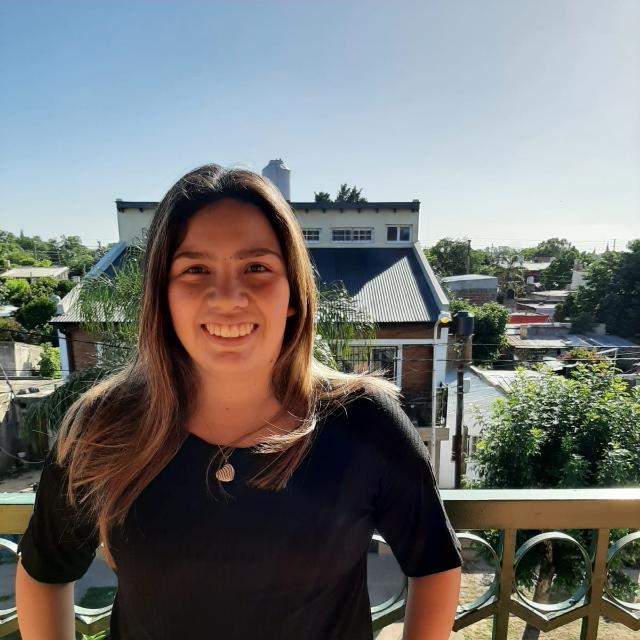

## Objetos 1 - Comisión2 T.Mañana

### Buenas, soy Vanina Cejas pero me dicen Vani 😁

## Materias aprobadas 📖
* Introducción a lógica y problemas computacionales
* Matemática para informática I
* Matemática para Informática II
* Organización de computadoras I
* Nuevos entornos y lenguajes
* Taller de lenguajes de marcado y tecnologías web
* Programación estructurada

